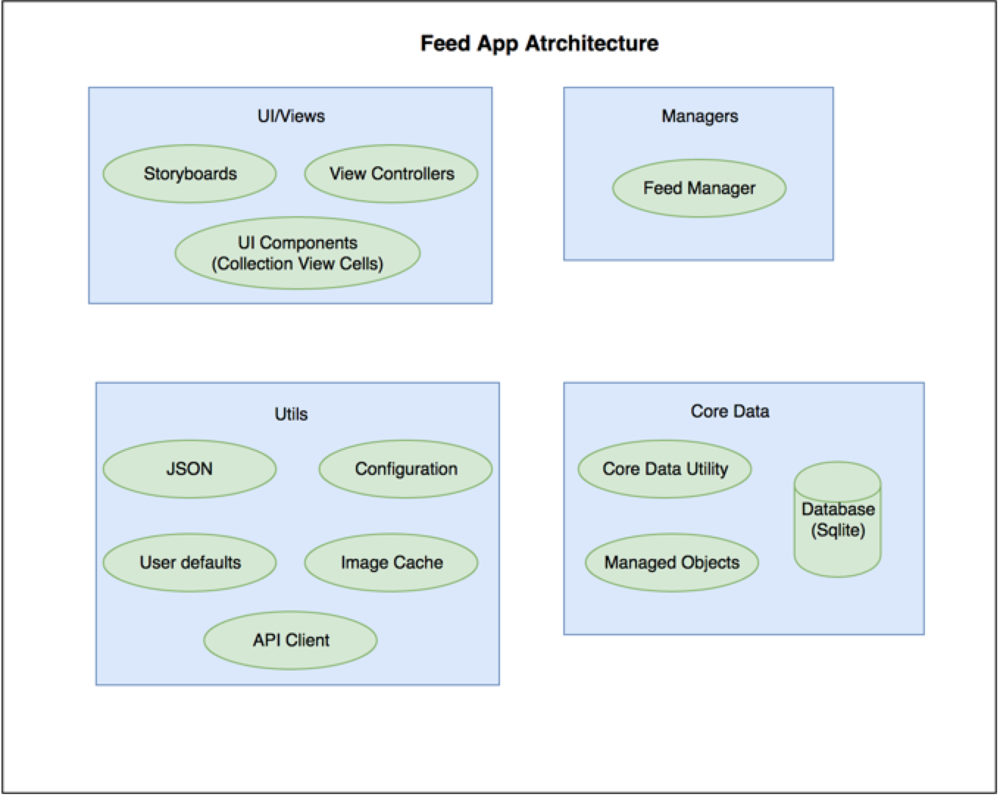
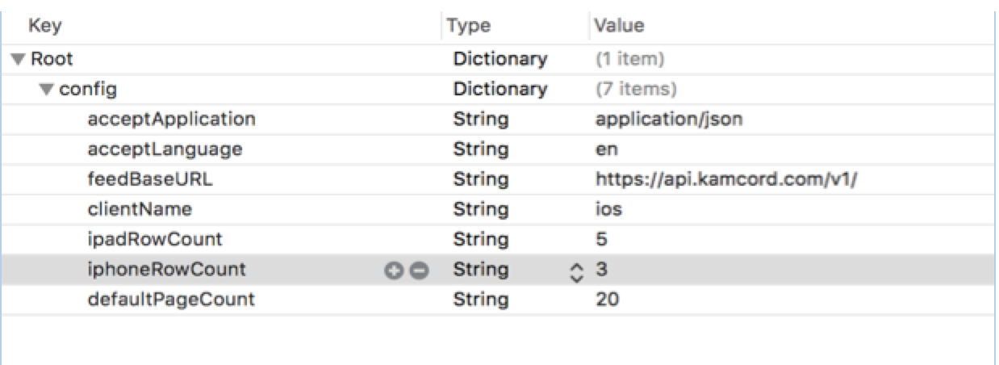
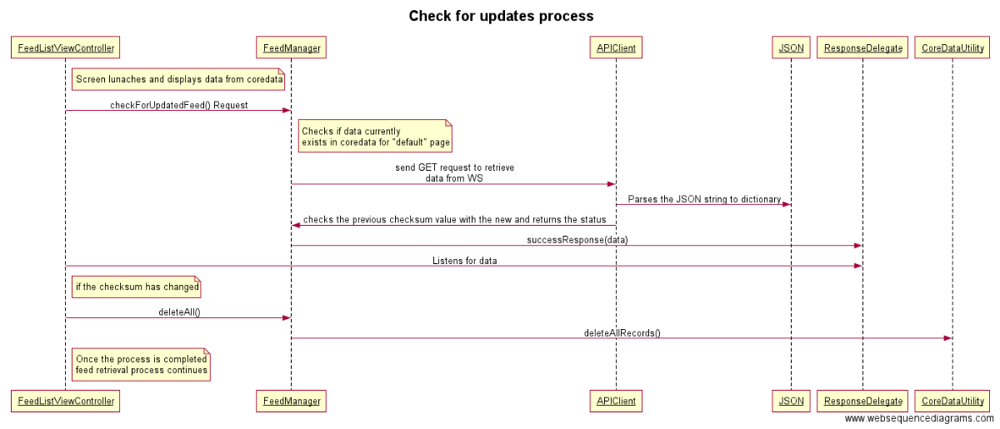
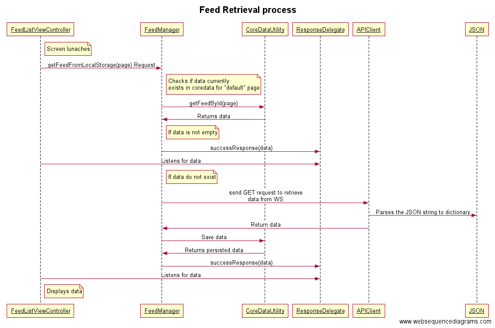
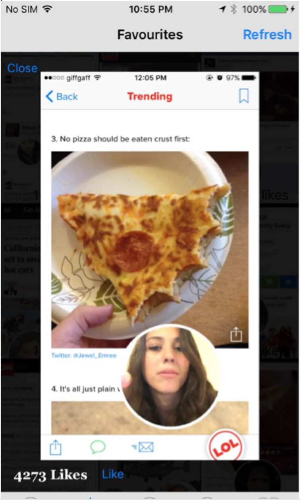
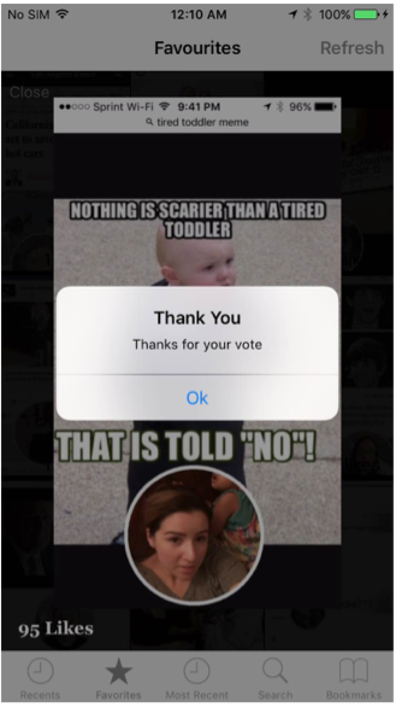

# Feed App

## Table of Contents

<!-- START doctoc generated TOC please keep comment here to allow auto update -->
<!-- DON'T EDIT THIS SECTION, INSTEAD RE-RUN doctoc TO UPDATE -->

  - [Introduction](#introduction)
  - [Application Architecture](#application-architecture)
  - [Configurations](#usage)
  - [Application Flow](#publishing-your-code)
  - [Screenshots](#extend-this-generator)
    

<!-- END doctoc generated TOC please keep comment here to allow auto update -->

## Introduction
> An application which retrieves feed from a source and lets the user browse through all the feeds with infinite pagination.

## Application Architecture

  - UI/Views
    - Storyboards
      - Main.storyboard holds the entire application UI flow, where it includes references to other storyboards (Feeds.storyboard) which caters different use cases.
    - View Controllers
      - Contains all the view controller classes
    - UI Components
      - Contains UI components such as Cell classes etc.
    - Managers - Lies between the views and the data/connection layer
    - Core data – Manages operations related to core data (persistence, fetching)
    - Utils
      - JSON – Manages json transforming to native objects, back and forth.
      - Configuration – Reads from default config plist
      - Image Cache – Use NSCache to save images temporary to improve performance while browsing through the data.
      - User defaults – Manages setting objects to user defaults and reading the relevant objects
      - APIClient – Manages HTTP requests
    - Design patterns and Object Oriented Concepts used
      - Singleton – Configuration, ImageCache, UserDefaults
      - Delegate – ResponseDelegate
      - Inheritance – CoreDataUtility->FeedCoreDataUtility 
      - Encapsulation enforced when possible – UserDefaults
      
## Configurations

> Configurable items are defined in config_default.plist

## Application Flow

> Feed Retrieval

> Check for updates

## Screenshots

